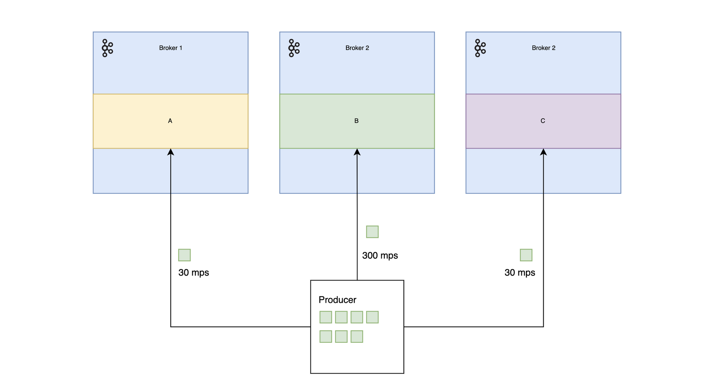

## Ссылки

- TFDS МФТИ. Лектор - Липовский Роман: [YouTube](https://www.youtube.com/watch?v=n0faRYjoom8&list=PL4_hYwCyhAvbof7wirWXeCH9wAfgDH0RI&index=16&t=2139s)
- Про Kafka: [YouTube](https://www.youtube.com/watch?v=-AZOi3kP9Js&t=53s)
- Kafka: The definitive guide 2nd edition [Confluent](https://www.confluent.io/resources/kafka-the-definitive-guide-v2/)
- Intuitive user timeouts [Kafka Wiki](https://cwiki.apache.org/confluence/display/KAFKA/KIP-91+Provide+Intuitive+User+Timeouts+in+The+Producer)
- Rebalancing: unofficial [guide](https://tomlee.co/2019/03/the-unofficial-kafka-rebalance-how-to/)
- Incremental Rebalance [Protocol](https://cwiki.apache.org/confluence/display/KAFKA/KIP-429%3A+Kafka+Consumer+Incremental+Rebalance+Protocol) 
- Ordering guaranties for idempotent producer [Kafka Github: PR 3734](https://github.com/apache/kafka/pull/3743)

## План

- Основные понятия
	- Kafka cluster
	- Message
	- Topic
	- Partitions
	- What is the purpose of partitions?
- Producer
	- Producer API
	- Message sending internals
	- Delivery semantics and delivery guarantee
	- Producer idempotence
	- Message ordering guarantee
	- Partitioning strategies
- Consumer
	- Consumer groups
	- Rebalancing overview
	- Consumer offsets
	- Commiting offsets
	- Delivery semantics

## Основные понятия.

### Kafka cluster

kafka - это кластер, который состоит из нескольких брокеров, чтобы поддерживать масштабирование и репликацию данных

### Kafka Broker

Это один сервер kafka. Для большей отказоустойчивости желательно, чтобы брокеры в кластере располагались на разных физических машинах. Но ограничений нет - это может быть и виртуалка, и docker-container.

### ZooKeeper

Для поддержания согласованности данных используется ZooKeeper - сервис координации, распределенная CP система. ZooKeeper предоставляет отказоустойчивый сервис хранения метаданных для Kafka и механизм распределенных блокировок.

ZooKeeper - быстро работает на операции чтения, и очень хорошо подходит для хранения метаданных и хранения состояния, если оно не часто меняется.


**Начиная с версии 2.8.0 вместо ZooKeeper можно использовать протокол [KRaft](https://issues.apache.org/jira/browse/KAFKA-9119) в качестве early access feature. А версия 3.0.0 предоставляет возможность использовать KRaft для продакшена**

### Kafka controller (или координатор)

Среди брокеров в кластере должен быть выбран координатор (контроллер).
Контроллер \- это роль, а не конкретный брокер. Машина, на которой расположен контроллер в данный момент, может отказать. Тогда в кластере должен быть выбран новый контроллер. При этом вся информация, которой обладал старый контроллер, должна стать доступна этому новому контроллеру.
Выбор нового контоллера осуществляется благодаря **ZooKeeper** с помощью механизма распределенных блокировок.

Контоллер отвечает за администрирование кластера, в том числе назначение партиций конкретным брокерам и мониторинг отказов брокеров.

### Клиенты kafka

Клиенты Kafka делятся на два вида:

- **producers** \- те, кто пишут сообщения в Kafka
- **consumers** \- те, кто читают сообщения из Kafka

### Message


#### Message (Data)

Единица данных в Kafka - это сообщение (Message).
Сообщение \- это просто набор байтов. Kafka никак их не интерпретирует.
За интерпретацию сообщений отвечают клиенты Kafka - producer-ы, и consumer-ы 
Producer-ы и Consumer-ы должны условиться о формате сообщения.

#### Key

Сообщение может иметь опциональный ключ (Key).
Для Kafka - это тоже просто набор байтов.
А интерпретируются они тоже на стороне клиентов.

#### Timestamp

Также вместе с сообщением передается Timestamp.

#### Headers

Опционально можно передавать заголовки - набор key-value пар с пользовательскими атрибутами.
Тип ключа - это всегда String.
А value - может быть любым сериализуемым объектом  (implements Serializable)

### Topics

Топик \- базовая сущность в Kafka. Топик представляет собой такую абстракцию как append-only log. Producer-ы добавляют сообщения в этот лог, а consumer-ы читают из него. Удалять или обновлять сообщения клиенты не могут.

Топики со всеми сообщениями хранятся на брокерах.

Топик \- **это не очередь**. Сообщения, прочитанные consumer-ом, не удаляются из топика.
Это позволяет нескольким consumer-ам независимо читать сообщения в топиках, и независимо их обрабатывать.

### Partition

Партиция как раз представляет из себя тот самый распределенной лог, в который добавляются сообщения, когда producer записывает его в топик.

Топик может состоять из одной или более партиций и по сути топик \- это просто логическое объединение набора партиций.


Фактически партиция \- это файл в файловой системе, который лежит на каком-то брокере, и в который producer-ы могут только добавлять записи.

Kafka гарантирует **порядок сообщений в рамках одной партиции.**
То есть в каком порядке сообщения были записаны producer-ом в партицию, в таком порядоке они будут прочитаны consumer-ами из этой партиции. Но здесь есть нюансы и эта гарантия может быть нарушена - это зависит от конфигурации producer-а.

Когда producer отправляет сообщение в топик, ему нужно выбрать, в какую партицию отправить сообщение.
Для этого есть различные стратегии.

Например по умолчанию:
- если не задан ключ, используется **round-robin**, когда новые сообщения поочередно отправляются в каждую партицию.
- если ключ задан, то партиция выбирается следующим образом:

```
partition = hash(key) % partition_count
```

При этом гарантируется, что сообщения с одними и теми же ключами попадут в одну и ту же партицию. Это может быть полезно, если нужно обрабатывать сообщения в определенном порядке.

Реализация хэш функции не привязана к Java, чтобы смена версии java не приводила к изменению партиций для сообщений с одними и тем же ключами.

### Зачем вообще нужны партиции?

#### Надежность

Сообщения в топике хранятся на kafka брокерах.
Брокер может выйти из строя. И если бы все данные топика находились на этом брокере \- то выход из строя этого брокера означал бы потерю данных всего топика.


На рисунке выше видно, что на Broker 2 находятся все 2 партиции топика B.
И если Broker 2 вышел из строя, то данные всего топика становятся недоступными.

Одна из задач партиционирования \- это обеспечение надежности.
Kafka старается распределять различные партиции топика по разным брокерам.

Поэтому если какой-то брокер выйдет из строя, то будет **потеряна только часть данных**, а не все.


Конечно, этого недостаточно для обеспечения надежности.
И в Kafka есть механизм репликации партиций, позволяющий еще больше снизить риск потери данных.
В кратце суть его в том, что для каждой партиции создается реплика.
И Kafka старается равномерно распределить эти реплики по брокерам.


Среди реплик выбирается один лидер. Остальные реплики \- follower-ы.
Запись сообщения происходит только в лидер-реплику.
Чтение, по умолчанию, происходит тоже только из лидер реплики, но **в новых версиях Kafka** **(Начиная с какой? - TODO)** consumer-ам можно дать возможность читать из follower-ов, чтоб распределить нагрузку по кластеру.
**Но о механизме репликации чуть дальше.**

#### Распределение нагрузки

В некоторые топики запись может осуществляться намного чаще чем в другие топики.
И если бы такой топик весь располагался на одном брокере, то этот брокер  
**(Broker B на диаграмме ниже)** был бы более нагружен, чем другие:



Разделение топика на партиции решает в том числе и эту проблему.

Разделяя топик на части - партиции, и распределяя эти партиции равномерно между брокерами, мы тем самым может распределить нагрузку по всему кластеру, чтобы **все брокеры были нагружены равномерно.**


#### Параллельная обработка сообщений

Рассмотрим такой пример.
Допустим топики не разделялись бы на партиции, а один топик соответствовал бы, условно, только одной партиции.
И вот Producer пишет в топик 20 сообщений в секунду.
А Consumer обрабатывает только 10 сообщений в секунду


В такой ситуации consumer не успевал бы обрабатывать сообщения и каждую секунду отставал бы на 10 штук. И вот, еще одна цель разделения топика на партиции - решить эту проблему.

Но просто разделение топика на партиции, конечно, решением не является. Consumer должен прочитать все сообщения из топика. И если consumer один, а партиций в топике несколько, consumer будет читать сообщения сразу из всех партиций:


И значит consumer все так же будет отставать.
Но сейчас разница в том, что у нас есть две партиции.
Можно попробовать создать второго consumer-а, чтобы каждый читал свою партицию, тем самым распараллелив и ускорив обработку.

Но если просто создать второго consumer-а, он, так же как и первый, будет читать из обеих партиций:


Но нам нужно не это.
Для реализации задуманного нужно логически объединить consumer-ов в группу, чтобы они "понимали", что не одни, и что им нужно читать только **их часть партиций.**


Такое объединение consumer-ов называется consumer-group. И при создании consumer-а нужно указать ему название группы. Подробнее об этом дальше.
* * *

## Producer

Чтобы отправлять сообщения в топик разработчикам предоставляется специальный Producer API.

### Producer API
Вот простой пример отправки сообщения:

```java
Properties producerConfig = new Properties();
producerConfig.put("bootstrap.servers", "localhost:19092,localhost:29092");
producerConfig.put("key.serializer", "org.apache.kafka.common.serialization.StringSerializer");
producerConfig.put("value.serializer", "org.apache.kafka.common.serialization.StringSerializer");

ProducerRecord<String, String> record = new ProducerRecord<>("TestTopic", "String value");
var producer = new KafkaProducer<String, String>(producerConfig);
producer.send(record, new Callback() {
    @Override
    public void onCompletion(RecordMetadata metadata, Exception e) {
        if (e != null) {
            log.error("Couldn't send message: topic = {}, partition = {}",
                    metadata.topic(),
                    metadata.partition(),
                    e
            );
        }
    }
});
```

Kafka producer имеет три обязательные настройки:
 - `bootstrap.servers` - адреса подмоджества брокеров, перечисленные через запятую (без пробела)
 - `key.serializer` - класс сериалайзер, который будет преобразовывать ключ в байты
 - `value.serializer`  - класс сериалайзер, который будет преобразовывать значение в байты

**Важно!**: Экземпляр **KafkaProducer-а - потокобезопасный**. 

Первым делом нужно создать `record`, которая на вход принимает:
- название топика
- сообщение
- номер партиции (опционально)
- ключ (опционально)
- заголовки (опционально)
- timestamp (опционально). Если не указан - передается текущее время.

```java
var newRecord = new ProducerRecord<String, String>(
		"TestTopic",
		1, // partition
		"String key",
		"String value"
);
```

**Важно!**: key.serializer нужно указывать даже если ключ в сообщении не передается. При этом можно указать пустой сериалайзер:
`org.apache.kafka.common.serialization.VoidSerializer`

Чаще всего **сообщения отправляются асинхронно** методом `send(ProducerRecord, Callback)`,
и Callback будет вызывать, если:
- Сообщение не было отправлено - во время отправки произошла ошибка  
 (exception != null)
- Сообщение было отправлено и Kafka broker вернул ответ:
	- Если в ответе была ошибка, то exception != null

**Важно!**:
Callback вызывается в основном потоке producer-а.
Это позволяет получить гарантию, что если два сообщения отправлены в один топик и одну партицию, то callback-и для этих сообщений будут вызываны в том же порядке, что и методы отправки этих сообщений.

Но в то же время это значит, что если в Callback будет вызываться какая-то сложная логика, то это будет сильно тормозить отправку последующих сообщений.
Поэтому сам callback должен завершаться быстро, а сложная логика должна исполнятся в других потоках.

### Механизм отправки сообщений

Хоть отправка сообщений происходит и асинхронно, сам метод send может вернуть управление вызывающей функции не сразу.
Чтобы понять, в чем дело, нужно рассмотреть процесс отправки сообщений изнутри.

**И нужно иметь ввиду несколько моментов**:

**Во первых**, как уже поминалось выше, для гарантии надежности доставки Kafka предоставляет механизм репликации партиций.
Для каждой партиции топика создаются одна или несколько реплик. Одна из этих реплик выбирается в качестве лидера, остальные реплики - follower-ы. И все реплики равномерно распределяются по брокерам кластера.

Producer отправляет сообщения всегда в leader-реплику. А follower-ы периодически запрашивают данные из лидера, чтобы сохранять актуальное состояние.

**Во вторых**, на процесс отправки очень сильно влияет конфигурация producer-а.

**В третих**, за отправку сообщений в Kafka отвечает отдельный поток - Sender thread. В то время как главный поток (Main thread) producer-а формирует сообщения и подготавливает их к отправке.

#### Запрос метаданных

Чтобы узнать конфигурацию кластера - какие партиции есть у топика, кто лидер этих партиций и т.д. Producer делает запрос метаданных: `MetadataRequestData`.
Этот запрос происходит в главном (Main thread) потоке producer-а.
До тех пор, пока от Kafka кластера не пришел ответ с метаданными, метод send блокирует поток.
Настройка  `max.block.ms` отвечает за максимальное время ожидание.
Если оно превышено, то метод send бросает исключение.


#### Создание batch - `batch.size`

Когда Producer получает метаданные кластера, он узнает, кто является лидером партиции, в которую нужно отправить сообщение и складывает сообщение в batch.
Сообщения отправляются не по отдельности, а пачками (batch-ами). Это позволяет сократить накладные расходы на отправку tcp пакетов, тем самым повысив пропускную способность (throughput) producer-а.

Размер batch-а конфигурируется параметром:  
`batch.size` - размер в байтах **(не в сообщениях!)**
Эта настройка контролирует максимальный размер пачки.

По-умолчанию, Sender не будет ждать, пока batch полностью заполнится - как только Sender thread освобождается, он отправляет следующий batch, даже если в нем
только одно сообщение.

#### Ожидание, когда заполнится batch

За отправку batch-ей отвечает отдельный поток - Sender thread. Он берет готовые к отправке batch-и и отправляет в Kafka. 

По умолчанию batch готов к отправке как только он создан. И если Sender готов его отправить - он его отправит.
Но есть настройка:
`linger.ms` - которая определяет **время, в течение которого Sender будет ждать пока в batch поступят новые сообщения**, прежде чем отправить его.

И batch считается готовым, либо когда заполнится - то есть размер будет равен `batch.size`, либо после истечении `linger.ms`. 
То есть если время истекло, а он не заполнен - он все равно считается готовым к отправке.

#### Буфферизация

Новые сообщения могут появляться быстрее, чем Sender их отправляет.
Соответственно batch-и нужно где-то хранить. Это место называется **буфером отправки**.
Параметр `buffer.memory` отвечает за **размер буфера в байтах**.

Когда в буфере не хватает места, метод send блокируется на некоторое время, ожидая, пока место освободится.
Максимальное время ожидания все те же `max.block.ms`.
Если оно будет превышено - метод send бросает исключение.


#### Отправка

Итак, когда batch готов, Sender отправляет его в Kafka.
Kafka может долго не отвечать, поэтому есть конфиг:  
`request.timeout.ms`  
который отвечает за максимальное время ожидания ответа от Kafka.
Если время ожидания превышено, то:
- либо сразу будет выброшено исключение TimeoutException
- либо producer попробует отправить batch еще раз (за это отвечают настройки ретраев)


Есть нюанс в том, как именно Sender отправляет batch-и.

Есть настройка 
`max.in.flight.requests.per.connection` (по-умолчанию = 5)
которое отвечает за то,  
**сколько батчей Sender отправит не дожидаясь ответа от брокера**.

Благодаря этой настройке можно повысить пропускную способность (throughput) producer-а.

[Эксперименты](https://cwiki.apache.org/confluence/display/KAFKA/An+analysis+of+the+impact+of+max.in.flight.requests.per.connection+and+acks+on+Producer+performance) показывают, что в рамках одного датацентра  
`max.in.flight.request.per.connection = 2`  
дает оптимальные результаты для пропускной способности.

#### Ретраи

В случае, если Kafka вернула ошибку, producer может попробовать заретраить отправку батча.
Значение конфига `retries` отвечает за кол-во попыток.
А значение `retries.backoff.ms` - за время между попытками.
(`retries.backoff.ms = 100` по умолчанию)

Не все ошибки имеет смысл ретраить, и в Prodcer API это уже учтено.
Например, если producer не дождался ответа в течение `request.timeout.ms` - имеет смысл повторить запрос еще раз, и producer сам это сделает. Разработчику не придется делать это руками.

Если же, например, от Kafka вернулась ошибка "размер сообщения превышен", смысла ретраить нет. И producer выдаст разработчику исключение сразу.

Если producer исчерпал все попытки, настроенные в `retries`, или же вернулась ошибка, которую нет смысла ретраить - будет вызыван Callback, который передается вторым параметром в метод send(record, Callback),  и в Callback будет передано исключение, которое уже разработчик должен будет самостоятельно обработать.

```java
producer.send(record, new Callback() {
    @Override
    public void onCompletion(RecordMetadata metadata, Exception e) {
        if (e != null) {
            log.error("Couldn't send message: topic = {}, partition = {}",
                    metadata.topic(),
                    metadata.partition(),
                    e
            );
            throw new RuntimeException(e);
        }
        log.info("Message was successfully sent");
    }
})
```


Однако использовать настройки ретраев напрямую не рекомендутся.
Дело в том, что Kafka - распределенная система, в которой возможны сбои, брокеры могут выпадать из кластера по различным причинам и на неопределенное время. Очень сложно вычислить, сколько ретраев разумно настроить в таких условиях.

Рекомендуется использовать другой подход. Об этом в следующем пункте.

#### Время отправки сообщения

Вышеперечисленные настройки:
- max.block.ms
- linger.ms
- request.timeout.ms
- retries
- retries.backoff.ms

так или иначе влияют на время отправки сообщения. 

Producer API предоставляет еще одну очень удобную настройку:
`delivery.timeout.ms` - ограничивает время, которое producer может потратить на отправку сообщения начиная с момента, когда метод send() вернул управление (то есть сообщение успешно помещено в батч), и до момента, когда либо брокер не ответит, либо не будут исчерпаны все попытки ретраев.

Если сообщение не было успешно отправлено в течение `delivery.timeout.ms`, то вызывается Callback с исключением.
В случае, если  `delivery.timeout.ms` было превышено в период ожидания отправки сообщения в буфере, то Callback вызывается с TimeoutException.

Если же время было превышено во время ретраев - Callback вызовится с исключением, которое было на крайней попытке ретраев.

Диаграмма ниже показывает, как эта настройка связана с другими:


**Важно!**: На эту настройку накладывается ограничение:
`delivery.timeout.ms >= linger.ms + retry.backoff.ms + request.timeout.ms`  
Если попытаться создать producer с неправильной конфигурацией таймаутов - будет выброшено исключение.

#### Рекомендации по настройке ретраев

Вместо явных настроек `retries` и `retries.backoff.ms` [рекомендуется
использовать](https://cwiki.apache.org/confluence/display/KAFKA/KIP-91+Provide+Intuitive+User+Timeouts+in+The+Producer) `delivery.timeout.ms`.

Можно настроить `delivery.timeout.ms` на максимальное время, в течение которого вы готовы ждать получения ответа от брокера. А конфигурацию ретраев оставить дефолтную (условно бесконечное кол-во).
С такой конфигурацией producer совершит столько попыток, сколько хватит по времени (ну или пока не вернется успешный ответ).

Это более разумный способ думать о ретраях. Например, можно рассуждать так:
"В случае выхода брокера из строя, требуется обычно 30 секунд на переизбрание лидера партиций. Так что давайте будем ретраить 120 секунд, чтобы наверняка"

Так что можно просто измерить, сколько требуется системе на восстановление после того, как один из брокеров вышел из строя, и в соответствии с этим подобрать значение  `delivery.timeout.ms`.


### Гарантии доставки и семантика доставки сообщения

Как уже было сказано ранее, сообщение отправляется в конкретную партицию топика. И в кластере может быть настроена репликация партиций.
И запись происходит в leader-партицию, а follower-ы периодически подтягивают данные из лидера, чтобы оставаться в актуальном состоянии.

Producer может работать в трех режимах гарантии доставки, которые значительно влияют на пропускную способность.

Настройка `acks` контролирует, сколько реплик партиции должны получить сообщение, чтобы producer считал его доставленным.

До версии 3.0.0 по умолчанию Kafka отправит ответ о том, что сообщение успешно сохранено после того, как лидер-партиция получит сообщение.

**`acks=0`**

Producer не будет ждать подтверждения вообще. Это позволяет достичь минимальной задержки (latency), однако если producer не ждет подтверждения, нет никакой гарантии, что даже лидер получит это сообщение. Соответственно сообщения могут теряться.
Такая семантика доставки сообщения называется **at most once**.  
То есть сообщения будут доставлены максимум один раз. Дубликаты исключаются, а вот потери как раз нет.

**`acks=1`**

Producer будет ждать подтверждение только от лидер-реплики. Если leader по каким-то причинам не сможет получить сообщение (например, он вышел из строя), producer получит ошибку, и может заретраить ее.
Этот вариант более надежный, чем первый, однако сообщения все равно могут теряться. Лидер может получить сообщение, но выйти из строя до того, как follower-ы подтянут сообщение себе. 
То есть семантика все та же - **at most once**

**`acks=all`**

Самая сильная гарантия доставки сообщения. 
В каждый момент времени различное кол-во follower-ов может быть в синхронизированном состоянии с лидером. 
Producer будет ждать, когда все синхронизированные в данный момент реплики получат сообщение.

**Важно понимать**, что может оказаться так, что follower-ы еще не успели подтянуть новые сообщения, и только leader находится в актуальном состоянии. То есть кол-во синхронизированных реплик = 1. 
И в этом случае, когда еще только leader получил сообщение, оно уже считается доставленным.
Поэтому просто так `acks=all` не гарантирует, что сообщение будет надежно сохранено. Оно все равно может потеряться, если leader откажет.

Чтобы гарантировать, что некоторые другие реплики, помимо лидера, тоже получат сообщение, Kafka брокеры имеют специальную настройку:  
`min.insync.replicas` (по умолчанию = 1) 

Если `min.insync.replicas > 1`, то Kafka обязана записать сообщение в соответствующее кол-во синхронизированных реплик.

И если в момент отправки сообщения кол-во синхронизированных реплик меньше, чем `min.insync.replicas`, Kafka вернет producer-у ответ с исключением `NotEnoughReplicasException`.

**Касательно семантики доставки.**

Представьте, что брокер получает запись, сохраняет себе, дожидается, пока in-sync follower-ы подтянут себе сообщение, и внезапно выходит из строя.
Producer спустя время `request.timeout.ms` получит TimeoutException, и попробует заретраить сообщение.

Новый лидер получает сообщение и сохраняет его себе. Но новый лидер - это один из in-sync follower-ов, которые успели загрузить себе это сообщение. Поэтому лидер сохраняет дубликат.

Таким образом, `acks = all` обеспечивает семантику доставки **at least once**
То есть сообщение доставляется **как минимум один раз**, а может и больше.

### Идемпотентность producer-а

Допустим вы сконфигурировали producer для обеспечения максимальной надежности:  `acks=all` и достаточно большой `delivery.timeout.ms`,

В предыдущем разделе мы увидели, что такая конфигурация не исключает дубликаты.

Чтобы этого избежать producer поддерживает режим идемпотентности.
За это отвечает настройка: `enable.idempotence = true`

При этом каждому сообщению ставится в соответствие порядковый номер.
Kafka по умолчанию отслеживает 5 последних сообщений в рамках каждой партиции, соблюдая в них порядок и предотвращая дублирование.

Если в этом случае лидер получит сообщение, и увидит, что сообщение с таким номер уже сохранено в партицию, то producer получит ответ с исключением: `DuplicateSequenceException`.

 ### Гарантия порядка в рамках партиции

Утверждается, что Kafka гарантирует порядок сообщений в рамках партиции.
Это значит, что если producer отправил сообщения в Kafka в определенном порядке, то брокер запишет их в партицию в таком же порядке, и все consumer-ы будут читать их в этом порядке.

Порядок очень важен для некоторых use-case-ов.

Однако, **по умолчанию начиная с версии 2.6.x [эта гарантия не соблюдается](https://kafka.apache.org/documentation/#producerconfigs_retries)!**
\[retries = Integer.MAX_VALUE a max.in.flight.requests.per.connection = 5\]

Если поставить кол-во ретраев `retries > 0`, а  
`max.in.flight.requests.per.connection > 1`,  
то есть вероятность, что брокер не сможет записать первый batch сообщений,
но запишет второй


затем producer заретраит первый batch, и брокер успешно его запишет.


В этом случае порядок будет нарушен.


И [судя по документации](https://kafka.apache.org/documentation/#producerconfigs_retries), елси `max.in.flight.reqest.per.connection > 1`,
порядок гарантируется только если `retries = 0`. 

**Важно!**: при дефолтных настройках Kafka **не гарантирует порядок** сообщений в рамках партиции начиная с версии 2.6

В Kafka [добавили возможность](https://github.com/apache/kafka/pull/3743) сохранять порядок, когда используется идемпотентный producer.
Это конфигурируется настройкой:  
`enable.idempotence = true`  

Теперь, в случае, если Kafka не сможет сохранить первый batch - все остальные тоже не будут успешно сохранены, и producer получит `OutOfOrderSequenceException`

### Стратегии партиционирования

Чтобы отправить сообщение в Kafka через Producer API нужно создать `record`:
```java
var record = new ProducerRecord<>(
	"TestTopic",
	"String value"
);
```

В конструктор можно передать просто топик и сообщение.
Но чаще сообщение содержит еще и ключ:

```java
var record = new ProducerRecord<>(
	"TestTopic",
	"String key",
	"String value"
);
```

Чаще всего ключ используется, чтобы определить партицию, в которую будет отправлено сообщение.

Первым делом запись (record) отправляется в `org.apache.kafka.clients.producer.Partitioner` и по дефолту используется алгоритм Round-Robin, для равномерного распределения сообщений по партициям.

Если ключ задан, то по дефолту партиция выбирается используя hash от ключа:
```java
Utils.toPositive(Utils.murmur2(keyBytes)) % numPartitions;
```

Потенциально возможно ситуация, что borker, на котором расположена лидер-реплика выбранной партиции недоступен, и запись в эту партицию завершится ошибкой. 

Можно реализовать свою стратегию партиционирования. Для этого нужно реализовать интерфейс     `org.apache.kafka.clients.producer.Partitioner`:

```java
package ru.max.kafka;

import org.apache.kafka.clients.producer.Partitioner;
import org.apache.kafka.common.Cluster;
import java.util.Map;

public class MyCustomPartitioner implements Partitioner {

    @Override
    public int partition(String topic, Object key, byte[] keyBytes, Object value, byte[] valueBytes, Cluster cluster) {
        if (key instanceof String s) {
            return Integer.parseInt(s);
        }
        throw new IllegalArgumentException("String is expected");
    }

    @Override
    public void close() {}

    @Override
    public void configure(Map<String, ?> configs) {}
}
```


И добавить конфиг producer-а - `partitioner.class`:
```java
public static Producer<String, String> customPartitionerProducer() {
	Properties producerConfig = new Properties();
	producerConfig.put("bootstrap.servers", "localhost:19092");
	producerConfig.put("key.serializer", "org.apache.kafka.common.serialization.StringSerializer");
	producerConfig.put("value.serializer", "org.apache.kafka.common.serialization.StringSerializer");
	producerConfig.put("partitioner.class", "ru.max.kafka.MyCustomPartitioner");

	return new KafkaProducer<>(producerConfig);
}
```
* * *


## Consumer

Как уже было сказано в первой части, consumer-ы читают сообщения из топиков Kafka.

### Consumer группы

Чтобы читать топики параллельно, нужно создать несколько consumer-ов и объединить их в группу.

Если один топик читают несколько consumer-ов объединенных в группу, каждый consumer будет потреблять сообщения из своего подмножества партиций - различные consumer-ы в группе читают сообщения из разных партций.

Например, есть топик T1 разделен на 4 партиции, и один consumer в группе G1 читает топик:


На диаграмме видно, что он будет потреблять сообщения из всех 4-ех партиций.

Если добавить второго consumer-а в группу, тогда каждый из них будет читать сообщения из двух партиций:


Если в G1 будут состоять 4 consumer-а, тогда каждому придется по одной партиции:


В большем кол-ве consumer-ов смысла нет. Если кол-во consumer-ов в группе больше, чем партиций в топике, то лишние consumer-ы будут простаивать:


Видно, что 5-ый consumer не будет вычитывать ни одну партицию.

Kafka спроектирована таким образом, чтобы давать возможность читать одни и те же данные разным потребителям независимо.

Допустим есть второе приложение, которое тоже хочет читать топик T1. Причем независимо от первого приложения.
Во втором приложении можно создать вторую группу consumer-ов - G2, которые точно также параллельно будут читать сообщения из различных партиций топика T1.


Конечно никто не мешает в двух различных приложениях, или, что логичнее, в двух запущенных экземплярах одного и того же приложения создавать две одинаковые consumer-группы. 


При этом нужно убедиться, что суммарное кол-во consumer-ов в обоих приложениях не превышает кол-во партиций в топике.
Иначе лишние consumer-ы все так же будут простаивать.

**Важно!**: нельзя создать несколько consumer-ов, которые оба работают в одном потоке. **Один consumer - один поток** - это правило. Чтобы в одном приложении запустить несколько consumer-ов в одной группе - нужно создать пулл потоков, и запустить consumer-ов в нем.

### Consumer API

Первый этап чтения сообщений - создание экземпляра consumer-а.

```java
var consumerConfig = new Properties();
consumerConfig.put("bootstrap.servers", "localhost:19092");
consumerConfig.put("group.id", "G1");
consumerConfig.put("key.deserializer", "org.apache.kafka.common.serialization.StringDeserializer");
consumerConfig.put("value.deserializer", "org.apache.kafka.common.serialization.StringDeserializer");
var consumer = new KafkaConsumer<String, String>(consumerConfig);
```

Так же как и для producer-а, определяем три обязательных конфига:
 - `bootstrap.servers`
 - `key.deserializer`
 - `values.deserializer`

Дополнительно объявляется идентификатор consumer-группы.
- `group.id`

Дальше нужно подписаться на получение сообщений из топика:

```java
consumer.subscribe(Collections.singleton("Test"));
```

Само чтение сообщений из топика происходит в бесконечном цикле.
Примерно так выглядит тело цикла:

```java

Duration timeout = Duration.ofMillis(100);
while (true) {
	ConsumerRecords<String, String> records = consumer.poll(timeout);
	for (ConsumerRecord<String, String> record : records) {
		log.info("topic = {}, partition = {}, offset = {}, key = {}, message = {}",
				record.topic(),
				record.partition(),
				record.offset(),
				record.key(),
				record.value()
		);
	}
}
```

Кол-во записей, которые возвращаются методом `poll(Duration)`, зависят от настройки: `max.poll.records`

**Важно!**: Как обсуждалось ранее, сообщения пишутся в leader-реплику партиции. И если producer позволяет позволяет нам выбрать семантику подтверждения сохранения сообщения (acks = 0,1,all), то consumer - нет.

Consumer может прочитать сообщение из топика только в том случае, если оно было записано **во все in-sync** реплики.

### Ребаллансировка consumer-ов

Как видно из примеров выше, при добавлении consumer-ов в существующую группу, новые consumer-ы начинают читать сообщения из тех партиций, из которых прежде читали другие, ранее присутствующие в группе consumer-ы.

Процесс перераспределения партиций между consumer-ами называется ребаллансировка.

Ребаллансировка происходит не только в случае добавления/удаления consumer-ов из группы, но также из-за увеличения кол-ва партиций в топике (напомню, что уменьшать кол-во партий в топике нельзя - это потеря данных).

#### Координатор группы

Для каждой consumer-группы среди брокеров назначается координатор группы.
Координатор - это не конкретный брокер. Это роль.
Один брокер может быть координатором для нескольких consumer-групп.
Но у одной consumer-группы только один координатор, что логично.

И если брокер, являющийся координатором выйдет из строя, будет выбран новый координатор. Но здесь есть нюансы.  
Подробнее об этом будет в отдельном разделе.

Координатор:
- следит за тем, что consumer-ы в группе исправно вычитывают сообщения из назначенных им партиций
- организует ребалансировку партиций топика между участниками группы

Для каждого consumer-а создается отдельный поток, который отправляет heartbeat-ы координатору, сообщая тем самым, что он в рабочем состоянии.
Настройка  consumer-а - `session.timeout.ms` - максимальное время, в течении которого consumer может не отправлять heartbeat-ы и считаться живым.
По истечении этого таймаута координатор группы отзовет партиции у этого consumer-а и запустит ребаллансировку.


Интервал отправки heartbeat-ов настраивается через `heartbeat.interval.ms`. Он не должен превышать `session.timeout.ms`. Рекомендуют ставить `heartbeat.interval.ms = 1/3 session.timeout.ms`

Heartbeat-ы - не единственный механизм, который сигнализирует о том, что consumer в строю и может обрабатывать сообщения.
Heartbeat-ы посылаются отдельным потоком и фактически показывают только то, что само приложение запущено и работает. Что нет проблем с сетью и т.д.

Но есть другая проблема. Она заключается в том, что основной поток consumer-а может потенциально зайти в deadlock, и сообщения не будут обрабатываться, несмотря на то, что heartbeat-ы продолжают отправляться.

Поэтому consumer будет считаться живым только в том случае, если он периодически будет выполнять запросы на получение сообщений от брокера через метод poll.
Настройка `max.poll.interval.ms` - максимальное время, в течении которого consumer может не вызывать метод poll и считаться живым.


Если это время истекло, и метод poll не был вызыван, отдельный поток consumer-а отправляет координатору запрос "покинуть группу", и координатор отзывает партиции у этого consumer-а и запускает ребаллансировку.

Значение `max.poll.interval.ms` должно быть достаточно велико, чтобы из группы не был удален нормально работающий consumer. В то же время оно не должно быть **слишком** велико, чтобы проблемный consumer был вовремя вычислен.

Чтобы poll вызывался достаточно часто, обработка сообщений в цикле должна происходить достаточно быстро.

Если обработка одного сообщения занимает относительно много времени, ускорить итерацию цикла можно уменьшив количество записей, которое возвращает метод `poll(Duration)`. Это, как уже было сказано выше, делается настройкой `max.poll.records`. Чем меньше записей нужно обработать - тем быстрее будут выполнятся итерации цикла, и тем быстрее будет вызываться метод `poll(Duration)`. 

### Consumer Offsets

Каждый consumer может читать данные независимо от других.

Какой-то consumer может читать их быстрее, какой-то медленнее. Суть в том, что делают они это **независимо**. Эта возможность есть благодаря тому, что consumer-ы для каждой партиции, из которой они читают сообщения, сохраняют порядковый номер сообщения, на котором остановились - offset.
Offset указывает на номер следующего сообщения, которое будет возвращено consumer-у методом `poll(Duration)`.

Каждое сообщение в партиции имеет свой уникальный offset.
Kafka внутри себя для каждого consumer-а хранит offset-ы каждой партиции каждого топика.
Таким образом consumer может перезагрузиться, остановив обработку сообщений, и затем начать читать сообщения заново с того места, где остановился, просто попросив у Kafka нужный offset.

После того, как  consumer обработал порцию сообщений, ему нужно сохранить место, где он остановился. Обновление значения offset-а называется коммитом оффсета (offset commit). 

Kafka из коробки хранит offset-ы партиций каждого consumer-а в специальном топике \_\_consumer_offsets. 

Таким образом, когда consumer рестартует, чтобы узнать место, откуда он будет продолжать читать, ему просто нужно прочитать топик \_\_consumer_offsets, и для каждой своей партиции найти нужный offset.

Ну кажется, что тут есть явный overhead. Ведь каждый consumer сохраняет offset-ы своих партиций довольно часто. И кажется, что топик \_\_consumer_ofsets должен быть очень большим.

#### Уплотнение топика __consumer_offsets

На самом деле в kafka есть механизм уплотнения (compaction) для топиков.
Если в топике есть две записи с одинаковыми ключами, механизм уплотнения оставит только одну запись - последнюю. Таким образом после уплотнения в топике не будет двух записей с одним и тем же ключом.


Этот механизм работает и для топика \_\_consumer_offsets.
Так consumer-ам не приходится отфильтровывать миллионы сообщений чтобы найти нужный offset для нужной партиции. Топик \_\_consumer_offsets после уплотнения имеет относительно небольшой размер.

### Стратегии коммита offset-ов

#### Automatic Commit
Самый просто способ сохранить offset - позволить consumer-у сделать это автоматически.
Настройка `enable.auto.commit` (по умолчанию `false`), позволяет настроить такое поведение.
При включенной настройке сохранение offset-а будет происходить по умолчанию каждые 5 секунд.
Это контролируется настройкой `auto.commit.interval.ms`

Каждый раз, когда вызывается метод `poll(Duration)`, consumer проверяет, а не пора ли сохранить offset.

Однако у автоматического commit-а есть последствия - потенциальное дублирование данных.

Допустим, что consumer получил записи, обработал какую-то часть в течение 3-ех секунд и вышел из строя.
Offset для уже обработанных сообщений не был сохранен.
Координатор группы в определенный момент запустит процедуру ребаллансировки, и какой-нибудь другой consumer в группе возьмет на себя освободившиеся партиции.

Этот consumer никак не узнает, что вышедший из строя "коллега" уже обработал часть сообщений. А потом прочитает все сообщения с последнего сохраненного offset-а и обработает их заново.

И если обработчик сообщений не идемпотентный, то в системе могут возникнуть нежелательные эффекты из-за повторной обработки сообщений.

Так что если дублирование в вашей системе может вызывать непоправимые последствия - автоматический коммит точно не для вас.

#### Явное сохранение текущего offset-а

Первый шаг к тому, чтобы контролировать коммит offset-ов - запретить автоматический коммит: `auto.commit.enabled = false`

После этого offset-ы могут быть сохранены только если явно об этом попросить.

Consumer API позволяет явно сохранять offset двумя способами:
 - синхронно - `consumer.commitSync()`
 - асинхронно - `consumer.commitAsync()`

**commitSync()**

**Важно!** помнить, что `commitSync()` сохраняет offset последнего сообщения, которое вернул `poll(Duration)`.

Поэтому, если закоммитить offset перед тем, как обработать сообщения, есть риск потерять сообщения, offset которых уже закоммичен, но при обработке котоорых произошла ошибка.

 Пример синхронного сохранения offset-а:
 ```java
ConsumerRecords<String, String> records = consumer.poll(timeout);
for (ConsumerRecord<String, String> record : records) {
	log.info("\n\ttopic = {}\n\tpartition = {}\n\toffset = {}\n\tkey = {}\n\tmessage = {}",
			record.topic(),
			record.partition(),
			record.offset(),
			record.key(),
			record.value()
	);
}
try {
	consumer.commitSync();
} catch (Exception e) {
	log.error("Error while committing offset", e);
}
```

`commitSync()` будет ретраится до тех пор, пока не достигнет успеха, либо пока не произойдет какая-то фатальная ошибка. В этом случае не остается ничего, кроме как залогировать ошибку.

Минус синхронного коммита в том, что основной поток consumer-а должен ждать ответ от кластера, что offset сохранен. Это сильно снижает пропускную способность (throughput).

**commitAsync()**

 ```java
ConsumerRecords<String, String> records = consumer.poll(timeout);
for (ConsumerRecord<String, String> record : records) {
	log.info("\n\ttopic = {}\n\tpartition = {}\n\toffset = {}\n\tkey = {}\n\tmessage = {}",
			record.topic(),
			record.partition(),
			record.offset(),
			record.key(),
			record.value()
	);
}
consumer.commitAsync();
```

Вместо того, чтобы ждать ответа от кластера - мы просто продолжаем обработку дальше.
Минус в том, что `commitAsync()` не будет пытаться ретраить ошибку, которую можно вообще говоря заретраить.
Тут дело в том, что коммитится offset последнего сообщения, которое вернулось из последнего вызова `poll(Duration)`.

А так как после вызова `commitAsync()` мы просто продолжаем обработку, есть большая вероятность, что если пытаться ретраить коммит - то мы закоммитим не тот offset, который нужно. И может закоммитить offset для новых сообщений, которые еще не были обработаны. И если при их обработке произойдет ошибка - мы потеряем данные.

`commitAsync()` позволяет передать Callback, который будет вызыван, когда broker пришлет ответ.

```java
consumer.commitAsync(new OffsetCommitCallback() {
	@Override
	public void onComplete(Map<TopicPartition, OffsetAndMetadata> offsets, Exception exception) {
		if (exception != null) {
			log.error("Error while committing offset {}", offsets, exception);
		}
	}
});
```

### Семантика доставки

#### At least once
Автоматический commit offset-ов удобен, но может возникнуть дублирование.
То есть сообщение может быть прочитано consumer-ом больше одного раза.
То есть хотя бы один раз. Такая семантика доставки сообщения называется **at least once.**

#### At most once

Если consumer вызовет commit сразу после того, как сообщения были прочитаны вызовом `poll(Duration)`, но до того, как они были обработаны, есть шанс, что consumer упадет, и после рестарта начнет уже с нового offset-а, хотя предыдущие сообщения не были обработаны. Таким образом данные потерялись.
Такая семантика доставки называется **at most once**

#### Exactly once

Если consumer сохраняет результаты обработки сообщений во внешнюю по систему (в БД, в другой кластер Kafka, в файловое хранилище и т.д.), то семантику exactly once из коробки не получится.

В зависимости от типа внешней системы, нужно по-разному подходить к решению проблемы. Однако во всех случаях решение крутится вокруг необходимости ручного управления offset-ами, а именно сохранять offset-ы вне Kafka.


